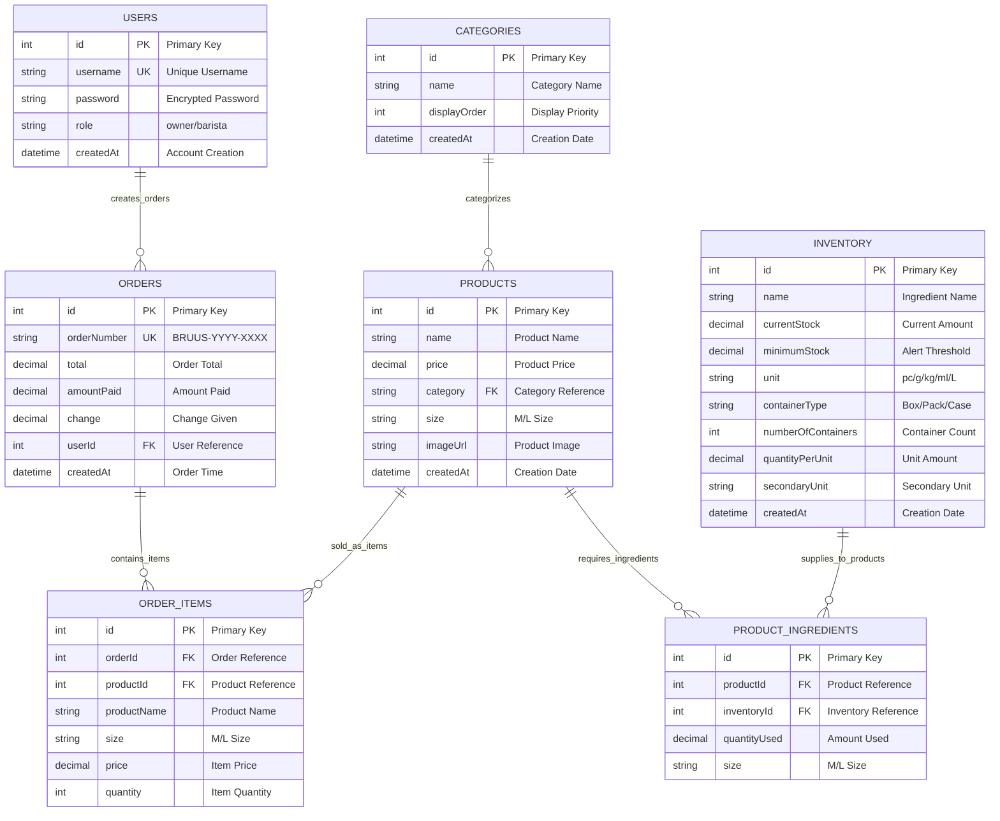
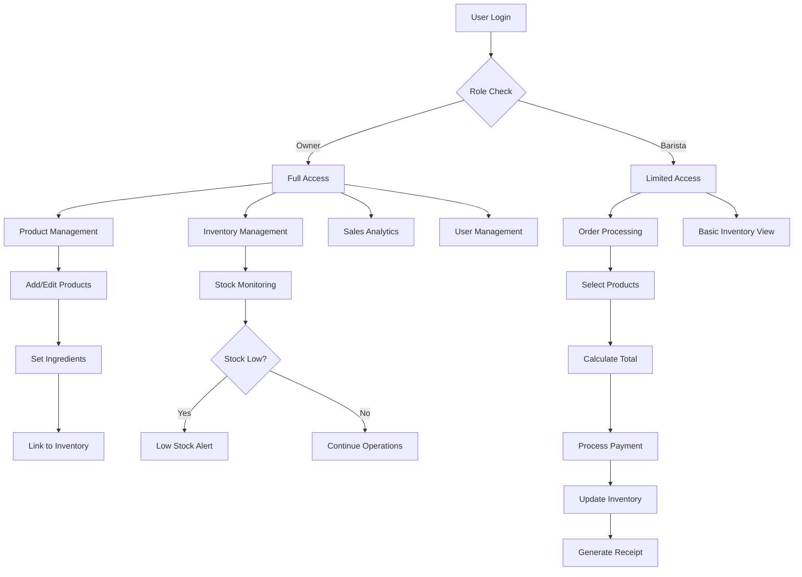
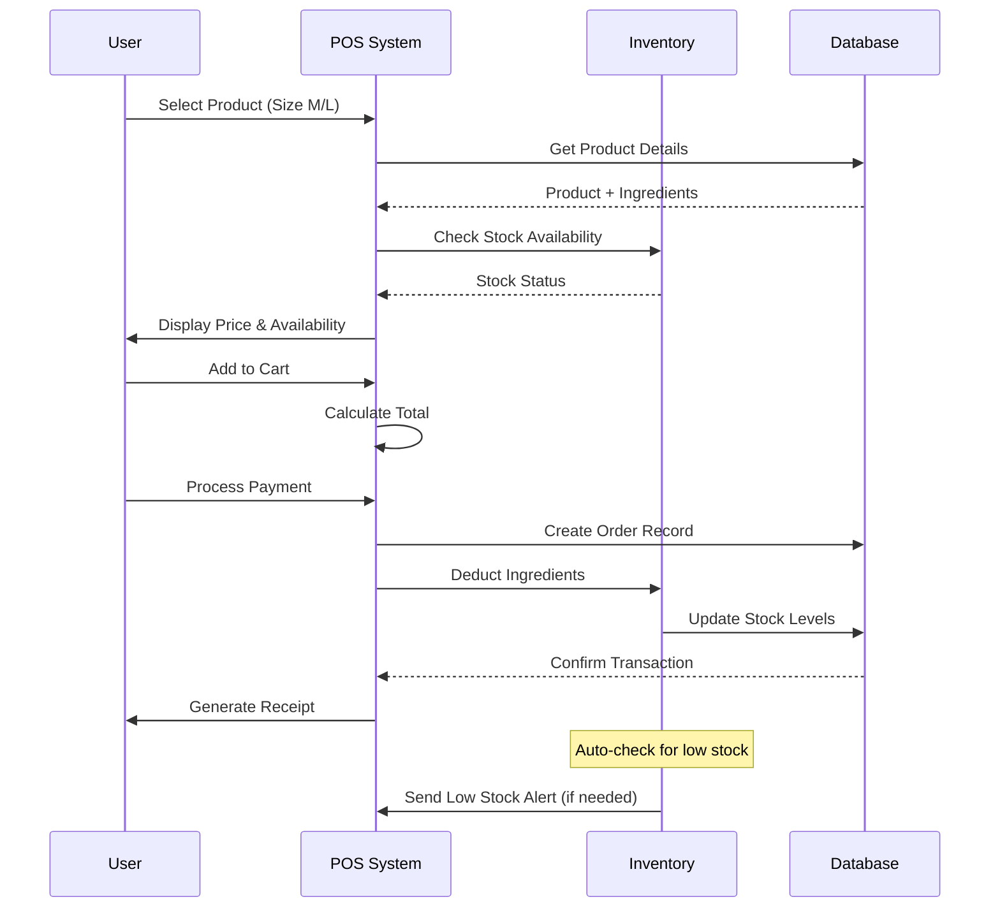
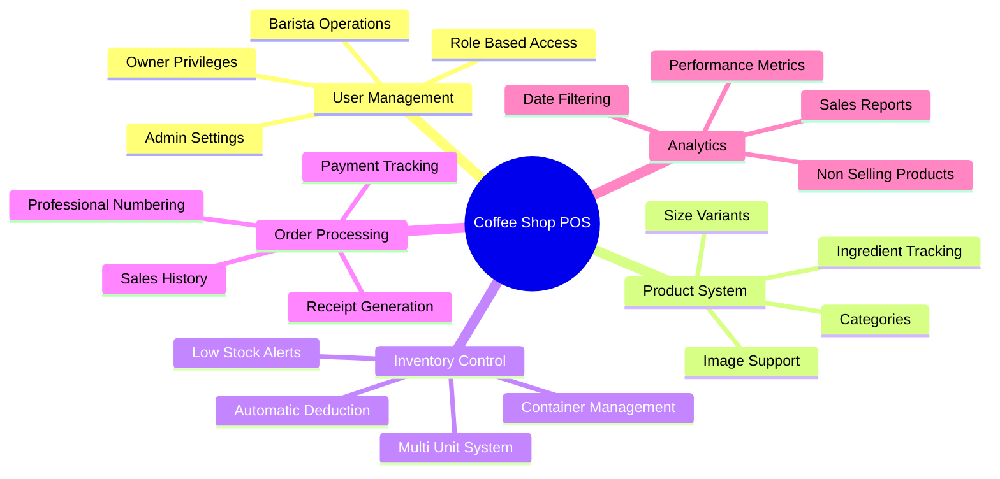

# Coffee Shop POS System - Mermaid ERD

## Interactive Database Schema Diagram

## System Workflow

## Data Flow Process

## Key Features Visualization

This Mermaid diagram can be viewed in any Mermaid-compatible viewer or platform that supports the syntax!