# Coffee Shop POS - Context Diagram

## System Boundary and External Interactions

```mermaid
graph TB
    %% External Entities
    owner["👑 Owner<br/>(Admin User)"]
    barista["☕ Barista<br/>(Staff User)"]
    customer["👤 Customer"]
    supplier["📦 Supplier"]
    manager["📊 Manager"]
    
    %% Central System
    subgraph system_boundary ["🏪 BRUUS Coffee Shop POS System"]
        pos["Point of Sale<br/>& Inventory Management<br/>Platform"]
    end
    
    %% External Storage/Services
    database["🗄️ PostgreSQL<br/>Database"]
    local_storage["💾 Local SQLite<br/>(Offline Mode)"]
    ipad["📱 iPad 10<br/>Device"]
    
    %% Data Flows - Owner
    owner -->|"Manages users & settings"| pos
    owner -->|"Views sales analytics"| pos
    owner -->|"Updates inventory"| pos
    owner -->|"Configures products"| pos
    pos -->|"System reports"| owner
    pos -->|"User management data"| owner
    
    %% Data Flows - Barista
    barista -->|"Processes orders"| pos
    barista -->|"Updates inventory"| pos
    barista -->|"Manages products"| pos
    pos -->|"Order confirmations"| barista
    pos -->|"Low stock alerts"| barista
    pos -->|"Product availability"| barista
    
    %% Data Flows - Customer
    customer -->|"Places orders"| pos
    customer -->|"Makes payments (₱)"| pos
    pos -->|"Order receipts"| customer
    pos -->|"Order status"| customer
    pos -->|"Change (₱)"| customer
    
    %% Data Flows - Supplier
    supplier -->|"Delivers inventory"| pos
    pos -->|"Purchase orders"| supplier
    pos -->|"Inventory requirements"| supplier
    
    %% Data Flows - Manager
    manager -->|"Requests reports"| pos
    pos -->|"Sales analytics"| manager
    pos -->|"Performance metrics"| manager
    pos -->|"Inventory status"| manager
    
    %% System Data Flows
    pos <-->|"Real-time sync"| database
    pos <-->|"Offline backup"| local_storage
    pos <-->|"Touch interface"| ipad
    
    %% Styling
    classDef user fill:#e3f2fd,stroke:#1976d2,stroke-width:2px
    classDef system fill:#fff3e0,stroke:#f57c00,stroke-width:3px
    classDef storage fill:#e8f5e8,stroke:#388e3c,stroke-width:2px
    classDef device fill:#f3e5f5,stroke:#7b1fa2,stroke-width:2px
    
    class owner,barista,customer,supplier,manager user
    class pos system
    class database,local_storage storage
    class ipad device
```

## External Entity Details

### **👥 System Users**
- **👑 Owner**: Full administrative access, manages all system aspects
- **☕ Barista**: Daily operations, order processing, basic inventory management
- **📊 Manager**: Views analytics and reports for business insights

### **🤝 External Stakeholders**
- **👤 Customer**: Places orders, makes payments in Philippine Pesos (₱)
- **📦 Supplier**: Provides inventory items, receives purchase orders

### **💻 Technical Infrastructure**
- **🗄️ PostgreSQL Database**: Primary data storage with real-time synchronization
- **💾 Local SQLite**: Offline backup ensuring system works without internet
- **📱 iPad 10 Device**: Primary interface optimized for touch interaction

## Key Data Flows

### **📊 Business Operations**
- **Order Processing**: Customer orders → POS → Receipt & Change
- **Inventory Management**: Supplier deliveries → System updates → Purchase orders
- **Sales Analytics**: Transaction data → Reports → Management insights

### **🔄 System Reliability**
- **Real-time Sync**: Continuous data backup to PostgreSQL
- **Offline Mode**: Local SQLite ensures uninterrupted service
- **Multi-user Access**: Role-based permissions for different user types

### **💰 Financial Transactions**
- **Payment Processing**: Customer payments in Philippine Pesos
- **Change Calculation**: Automatic change computation and dispensing
- **Sales Tracking**: Real-time revenue monitoring and reporting

This Context Diagram shows your coffee shop POS system as the central hub, clearly defining what's inside your system boundary versus external entities that interact with it. Perfect for understanding the complete ecosystem! 🎯