# Coffee Shop POS - Simple Context Diagram

## System Overview

```mermaid
graph TB
    %% Main Users
    owner["Owner"]
    barista["Barista"]
    customer["Customer"]
    
    %% Central System
    subgraph boundary ["BRUUS Coffee Shop POS"]
        pos["POS System"]
    end
    
    %% External Components
    database["Database"]
    ipad["iPad"]
    
    %% Simple Flows
    owner <--> pos
    barista <--> pos
    customer --> pos
    pos --> customer
    
    pos <--> database
    pos <--> ipad
    
    %% Labels
    owner -.->|"Admin Access"| pos
    barista -.->|"Daily Operations"| pos
    customer -.->|"Orders & Payment ₱"| pos
    pos -.->|"Receipts & Change"| customer
    
    %% Styling
    classDef user fill:#e3f2fd,stroke:#1976d2,stroke-width:2px
    classDef system fill:#fff3e0,stroke:#f57c00,stroke-width:3px
    classDef tech fill:#e8f5e8,stroke:#388e3c,stroke-width:2px
    
    class owner,barista,customer user
    class pos system
    class database,ipad tech
```

## Key Interactions

### **👥 Users**
- **Owner**: Admin access, manages settings and users
- **Barista**: Daily operations, processes orders
- **Customer**: Places orders, pays in Philippine Pesos (₱)

### **💻 Technology**
- **Database**: Stores all system data
- **iPad**: Touch interface for easy operation

## Simple Data Flow
1. **Customer** places order and pays ₱
2. **Barista** processes through POS on iPad
3. **System** saves to database and prints receipt
4. **Owner** can view reports and manage settings

Clean and focused on the essential interactions! 🎯