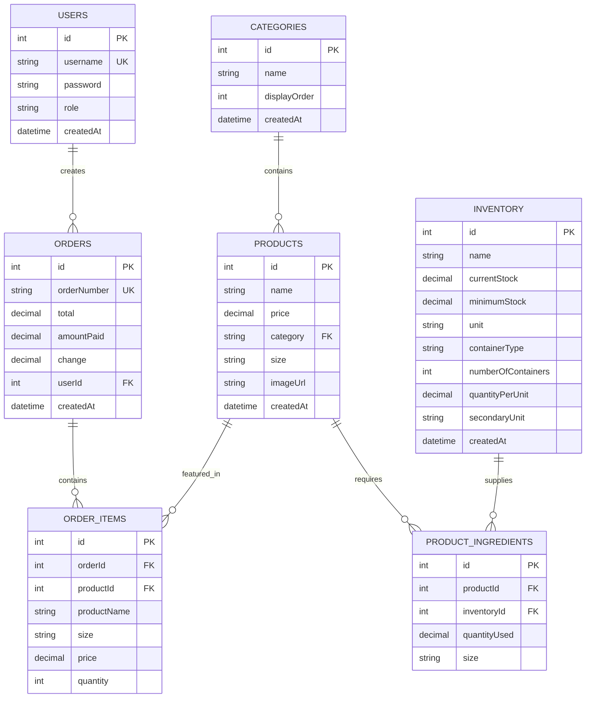

# Coffee Shop POS System - Entity Relationship Diagram

## Database Schema Overview

## Table Relationships

### Primary Relationships
1. **Users → Orders** (One-to-Many)
   - Each user can create multiple orders
   - Each order belongs to one user

2. **Categories → Products** (One-to-Many)
   - Each category contains multiple products
   - Each product belongs to one category

3. **Products → Product Ingredients** (One-to-Many)
   - Each product can have multiple ingredients
   - Each ingredient entry belongs to one product

4. **Inventory → Product Ingredients** (One-to-Many)
   - Each inventory item can be used in multiple products
   - Each ingredient usage references one inventory item

5. **Orders → Order Items** (One-to-Many)
   - Each order contains multiple items
   - Each order item belongs to one order

6. **Products → Order Items** (One-to-Many)
   - Each product can appear in multiple orders
   - Each order item references one product (nullable for deleted products)

## Key Features

### User Management
- **Role-based access**: Owner and Barista roles
- **Authentication**: Secure login system
- **Admin controls**: User creation and management

### Product Management
- **Categorized products**: Coffee, Tea, Food, Others
- **Size variants**: Medium (M) and Large (L) with different pricing
- **Image support**: Product images for visual menu

### Inventory Tracking
- **Multi-unit system**: Primary units (pc, g, kg, ml, L) and secondary units
- **Container management**: Box, Pack, Case with quantity per unit
- **Low stock alerts**: Automatic notifications when below minimum threshold
- **Ingredient tracking**: Links products to required inventory items

### Order Processing
- **Professional order numbers**: BRUUS-YYYY-XXXX format
- **Complete transaction tracking**: Amount paid, change calculation
- **Detailed order items**: Product name, size, price, quantity
- **Inventory deduction**: Automatic ingredient usage tracking

### Sales Analytics
- **Date range filtering**: Daily, monthly, custom periods
- **Product performance**: Sales volume and revenue tracking
- **Non-selling products**: Identify items not selling in time periods

## Data Integrity Features

### Foreign Key Constraints
- Maintains referential integrity between tables
- Prevents orphaned records
- Handles product deletion gracefully (order history preserved)

### Unique Constraints
- Usernames must be unique
- Order numbers follow professional format
- Category names are unique

### Audit Trail
- All tables include creation timestamps
- Order history preserved even when products are deleted
- Complete transaction records for financial tracking

This ERD represents a comprehensive POS system designed specifically for coffee shops with robust inventory management, user access control, and detailed sales tracking capabilities.