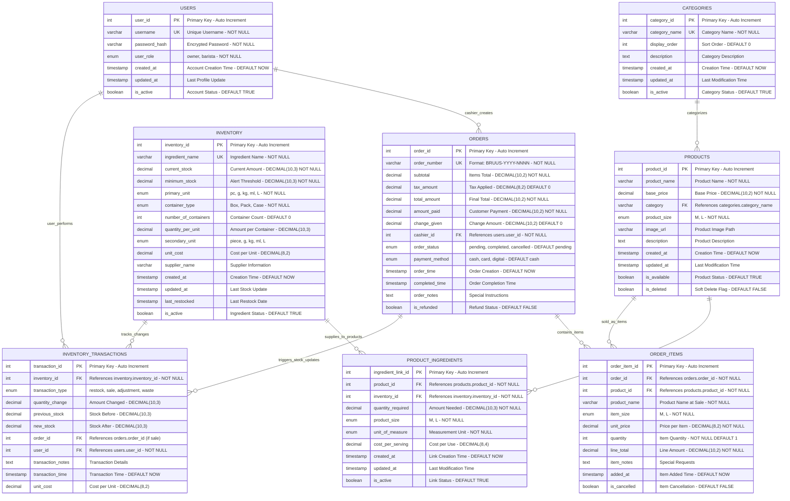

# Coffee Shop POS System - Professional Entity Relationship Diagram

## Academic Standard ERD for Relational Database

### Complete Entity Relationship Model



## Entity Descriptions and Business Rules

### **👥 USERS Entity**
**Purpose**: Manages system access and user roles
- **Primary Key**: `user_id` (Auto-incrementing integer)
- **Unique Constraints**: `username` must be unique across system
- **Business Rules**:
  - Only 'owner' role can delete products/inventory
  - 'barista' role limited to operational functions
  - Password must be hashed using secure algorithms
  - Account creation timestamp for audit trail

### **📂 CATEGORIES Entity**  
**Purpose**: Organizes products into logical groups
- **Primary Key**: `category_id` (Auto-incrementing integer)
- **Unique Constraints**: `category_name` must be unique
- **Business Rules**:
  - Display order determines menu arrangement
  - Soft delete preserves data integrity
  - Categories can be deactivated without deletion

### **🍕 PRODUCTS Entity**
**Purpose**: Defines menu items with pricing and specifications
- **Primary Key**: `product_id` (Auto-incrementing integer)  
- **Foreign Key**: `category` references `CATEGORIES.category_name`
- **Business Rules**:
  - Each size (M/L) requires separate record for pricing
  - Soft delete maintains order history integrity
  - Image URLs point to uploaded product photos
  - Price stored as DECIMAL for currency precision

### **📦 INVENTORY Entity**
**Purpose**: Tracks ingredient stock levels and container management
- **Primary Key**: `inventory_id` (Auto-incrementing integer)
- **Unique Constraints**: `ingredient_name` must be unique
- **Business Rules**:
  - Current stock auto-calculated from container quantities
  - Low stock alerts triggered when below minimum threshold
  - Multi-unit support (primary and secondary units)
  - Cost tracking for profit margin analysis

### **🔗 PRODUCT_INGREDIENTS Entity**
**Purpose**: Links products to required inventory ingredients
- **Primary Key**: `ingredient_link_id` (Auto-incrementing integer)
- **Foreign Keys**: 
  - `product_id` references `PRODUCTS.product_id`
  - `inventory_id` references `INVENTORY.inventory_id`
- **Business Rules**:
  - Different quantities for Medium vs Large sizes
  - Quantity deducted automatically on order completion
  - Cost per serving calculated for pricing analysis

### **🛒 ORDERS Entity**
**Purpose**: Records customer transactions and payment details
- **Primary Key**: `order_id` (Auto-incrementing integer)
- **Unique Constraints**: `order_number` follows format BRUUS-YYYY-NNNN
- **Foreign Key**: `cashier_id` references `USERS.user_id`
- **Business Rules**:
  - Professional order numbering system
  - Change calculation automated
  - Order completion triggers inventory updates
  - Payment method tracking for reporting

### **📝 ORDER_ITEMS Entity**
**Purpose**: Details individual products within each order
- **Primary Key**: `order_item_id` (Auto-incrementing integer)
- **Foreign Keys**:
  - `order_id` references `ORDERS.order_id`
  - `product_id` references `PRODUCTS.product_id`
- **Business Rules**:
  - Product name stored at sale time (historical accuracy)
  - Line total calculated from unit price × quantity
  - Individual item cancellation support

### **📊 INVENTORY_TRANSACTIONS Entity**
**Purpose**: Audit trail for all inventory movements
- **Primary Key**: `transaction_id` (Auto-incrementing integer)
- **Foreign Keys**:
  - `inventory_id` references `INVENTORY.inventory_id`
  - `order_id` references `ORDERS.order_id` (for sales)
  - `user_id` references `USERS.user_id`
- **Business Rules**:
  - Complete audit trail for stock changes
  - Before/after stock levels recorded
  - Transaction type categorization
  - Cost tracking for financial analysis

## Database Constraints and Indexes

### **Primary Key Constraints**
- All entities have auto-incrementing integer primary keys
- Ensures unique record identification across system

### **Foreign Key Constraints**
```sql
-- User-Order Relationship
ALTER TABLE orders ADD CONSTRAINT fk_orders_cashier 
FOREIGN KEY (cashier_id) REFERENCES users(user_id);

-- Product-Category Relationship  
ALTER TABLE products ADD CONSTRAINT fk_products_category
FOREIGN KEY (category) REFERENCES categories(category_name);

-- Product-Ingredient Relationships
ALTER TABLE product_ingredients ADD CONSTRAINT fk_ingredients_product
FOREIGN KEY (product_id) REFERENCES products(product_id);

ALTER TABLE product_ingredients ADD CONSTRAINT fk_ingredients_inventory  
FOREIGN KEY (inventory_id) REFERENCES inventory(inventory_id);
```

### **Unique Constraints**
```sql
-- Prevent duplicate usernames
ALTER TABLE users ADD CONSTRAINT uk_users_username UNIQUE (username);

-- Prevent duplicate order numbers
ALTER TABLE orders ADD CONSTRAINT uk_orders_number UNIQUE (order_number);

-- Prevent duplicate ingredient names
ALTER TABLE inventory ADD CONSTRAINT uk_inventory_name UNIQUE (ingredient_name);
```

### **Check Constraints**
```sql
-- Ensure positive quantities and prices
ALTER TABLE products ADD CONSTRAINT chk_products_price 
CHECK (base_price > 0);

ALTER TABLE inventory ADD CONSTRAINT chk_inventory_stock
CHECK (current_stock >= 0 AND minimum_stock >= 0);

ALTER TABLE orders ADD CONSTRAINT chk_orders_amounts
CHECK (total_amount > 0 AND amount_paid >= total_amount);
```

## Data Integrity and Normalization

### **First Normal Form (1NF)**
✅ All attributes contain atomic values
✅ No repeating groups or arrays
✅ Each record uniquely identifiable

### **Second Normal Form (2NF)**  
✅ All non-key attributes fully dependent on primary key
✅ No partial dependencies identified
✅ Separate entities for distinct concepts

### **Third Normal Form (3NF)**
✅ No transitive dependencies
✅ All non-key attributes depend only on primary key
✅ Calculated fields handled in application layer

This ERD represents a fully normalized, academically sound database design that supports all business requirements while maintaining data integrity and operational efficiency.