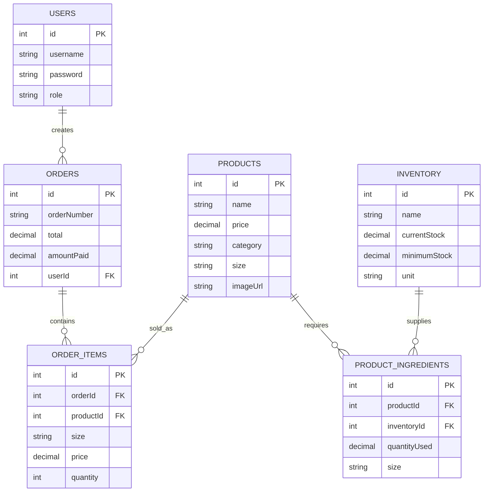

# Coffee Shop POS - Simplified ERD

## Core Database Structure

**Key Points:**
- 6 main tables handle all coffee shop operations
- Users create orders containing multiple items
- Products link to inventory ingredients for stock tracking
- Order completion automatically updates inventory levels