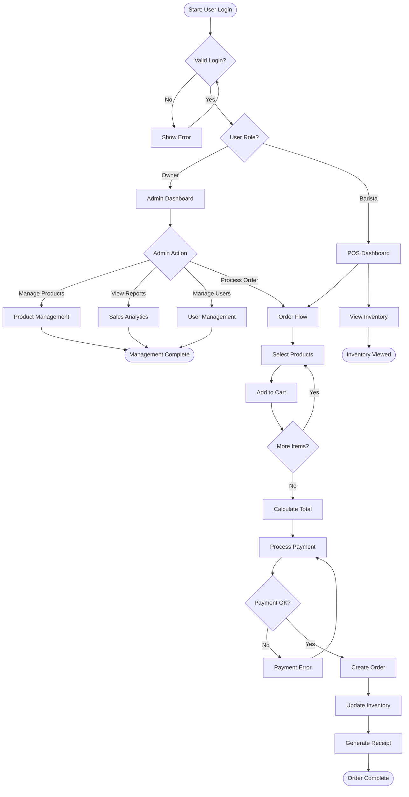

# Coffee Shop POS - Simplified Flowchart

## Main Business Process Flow

**Key Decision Points:**
- **Login Check**: Verify user access
- **Role Check**: Owner gets admin features, Barista gets POS
- **Payment Validation**: Ensure sufficient payment before completing order
- **Auto Updates**: Inventory automatically updated after each sale