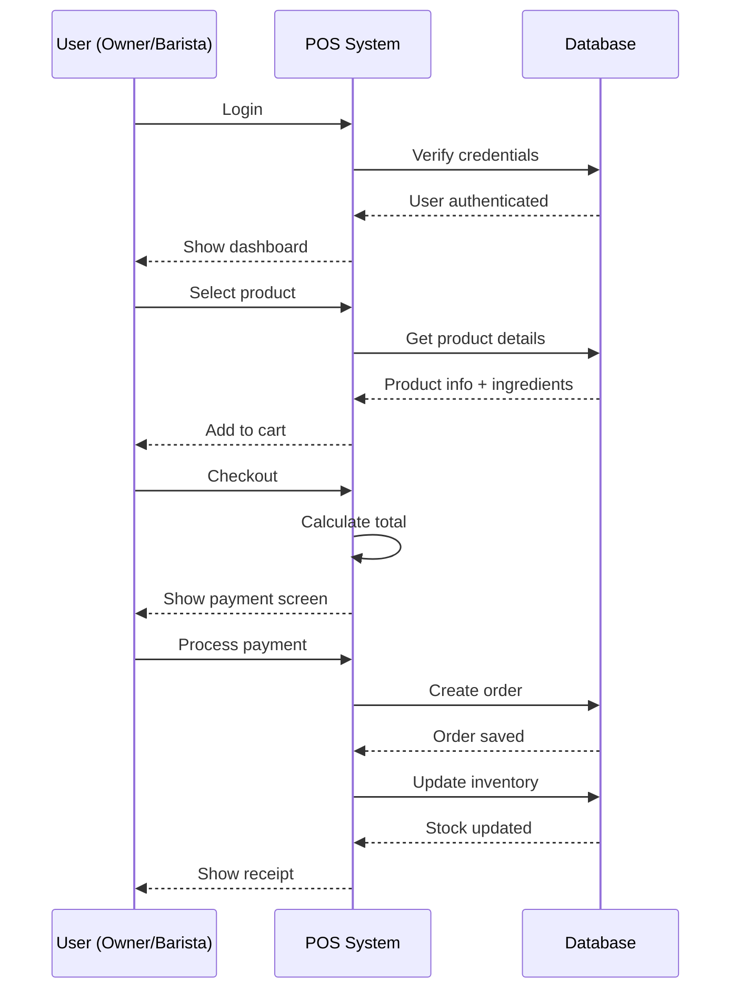
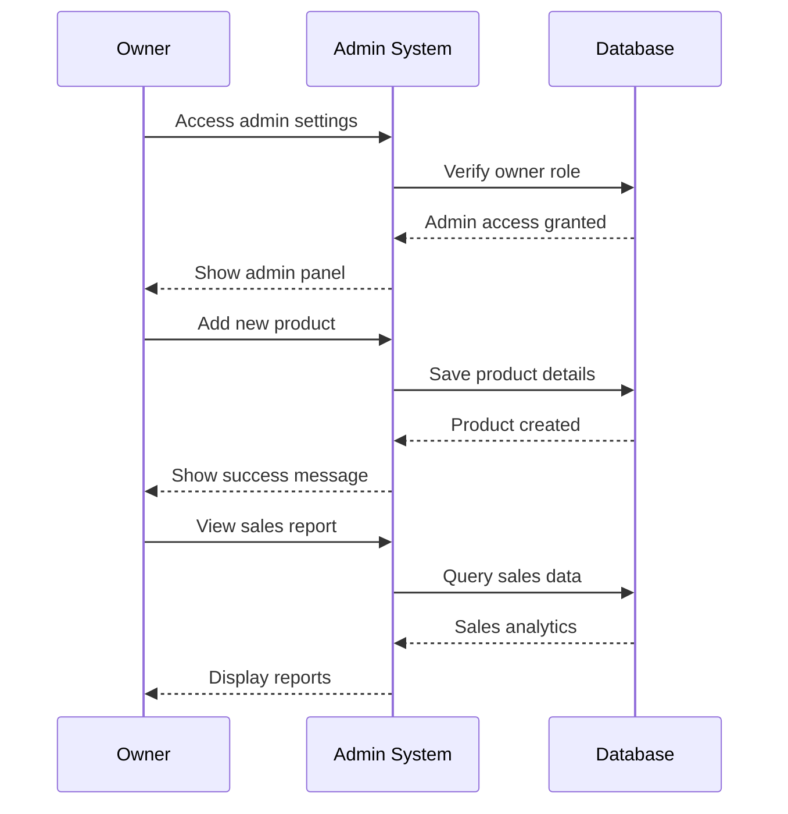

# Coffee Shop POS - Simplified Sequence Diagram

## Core System Interactions

### Order Processing Flow

### Owner Management Flow

**Key Functions:**
- **Both Users**: Can process orders and handle payments
- **Owner Only**: Admin features like product management and sales reports
- **Auto Updates**: Inventory changes automatically after each order