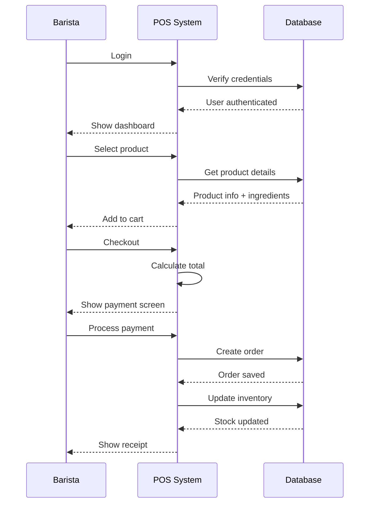

# Coffee Shop POS - Simplified Sequence Diagram

## Core Order Processing Flow

**Key Steps:**
1. **Login** - User authentication
2. **Select** - Choose products for order
3. **Payment** - Process customer payment
4. **Complete** - Save order and update inventory automatically