# Coffee Shop POS - Simplified Use Case Diagram

## Essential User Interactions

```mermaid
graph TB
    %% Main Actors
    Owner[👑 Owner]
    Barista[☕ Barista]
    
    %% Core Use Cases
    Owner --> UC1[Manage Users]
    Owner --> UC2[Add/Edit Products]
    Owner --> UC3[Manage Inventory]
    Owner --> UC4[View Sales Reports]
    Owner --> UC5[Process Orders]
    
    Barista --> UC5[Process Orders]
    Barista --> UC6[View Inventory]
    Barista --> UC7[Check Low Stock]
    
    %% Order Process Details
    UC5 --> UC5A[Select Products]
    UC5 --> UC5B[Calculate Payment]
    UC5 --> UC5C[Generate Receipt]
    
    %% Styling
    classDef actor fill:#e1f5fe,stroke:#01579b,stroke-width:2px
    classDef usecase fill:#f3e5f5,stroke:#4a148c,stroke-width:2px
    
    class Owner,Barista actor
    class UC1,UC2,UC3,UC4,UC5,UC6,UC7,UC5A,UC5B,UC5C usecase
```

**Key Functions:**
- **Owner**: Full system control (users, products, inventory, reports)
- **Barista**: Daily operations (orders, basic inventory monitoring)
- **Core Process**: Order processing is the main business function