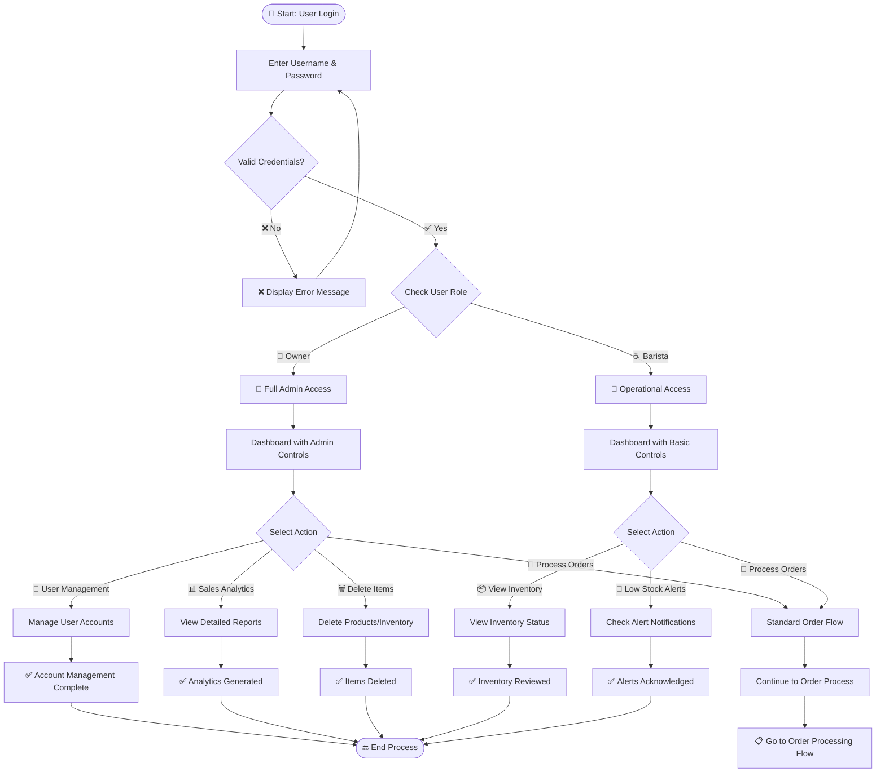
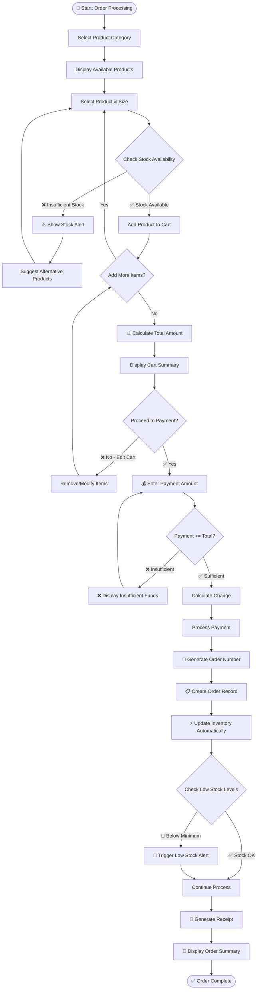
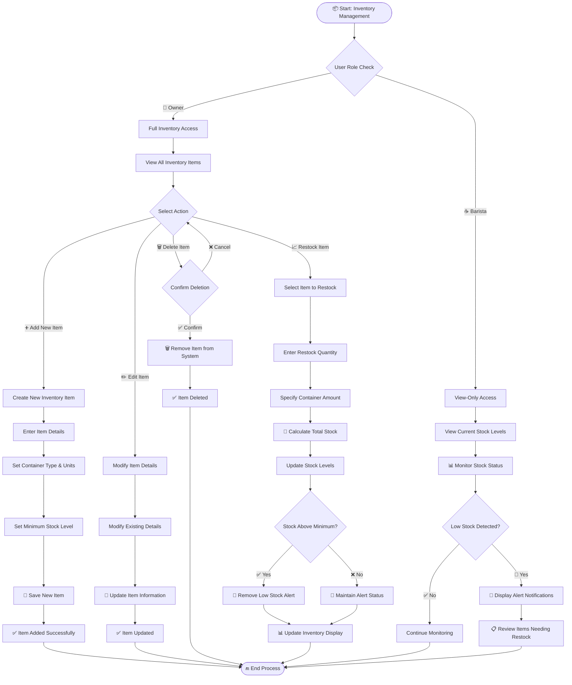
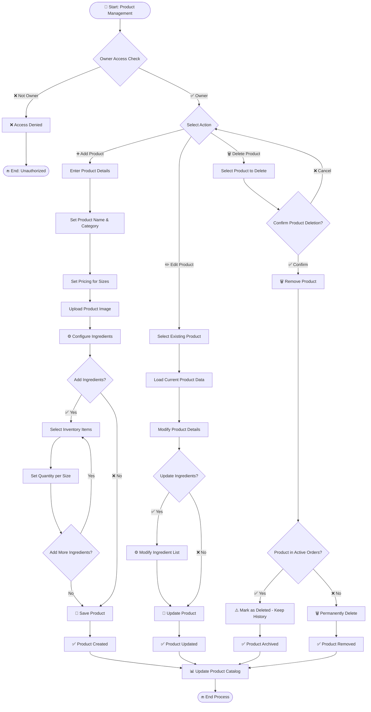

# Coffee Shop POS System - Process Flowcharts

## System Process Flow with Decision Points

### 1. User Authentication & Access Control Flow



### 2. Order Processing & Payment Flow



### 3. Inventory Management & Restocking Flow



### 4. Product Management Flow



### 5. Sales Analytics & Reporting Flow

```mermaid
flowchart TD
    A([📈 Start: Sales Analytics]) --> B{Owner Access Check}
    
    B -->|❌ Not Owner| C[❌ Access Denied]
    C --> D([🔚 End: Unauthorized])
    
    B -->|✅ Owner| E[📊 Access Analytics Dashboard]
    E --> F{Select Report Type}
    
    F -->|📅 Daily Sales| G[Select Specific Date]
    F -->|📆 Monthly Sales| H[Select Month & Year]
    F -->|🎯 Product Performance| I[Choose Date Range]
    F -->|❌ Non-Selling Items| J[Set Analysis Period]
    
    G --> K[🔍 Query Daily Order Data]
    H --> L[🔍 Query Monthly Data]
    I --> M[🔍 Query Product Sales]
    J --> N[🔍 Query Zero-Sale Products]
    
    K --> O{Data Found?}
    L --> P{Data Found?}
    M --> Q{Data Found?}
    N --> R{Data Found?}
    
    O -->|❌ No| S[📋 Display "No Sales" Message]
    P -->|❌ No| S
    Q -->|❌ No| S
    R -->|❌ No| T[📋 Display "All Products Selling"]
    
    O -->|✅ Yes| U[🧮 Calculate Daily Totals]
    P -->|✅ Yes| V[🧮 Calculate Monthly Summary]
    Q -->|✅ Yes| W[🧮 Analyze Product Performance]
    R -->|✅ Yes| X[📝 List Non-Selling Products]
    
    U --> Y[📊 Generate Daily Charts]
    V --> Z[📊 Generate Monthly Charts]
    W --> AA[📊 Create Performance Graphs]
    X --> BB[📋 Create Action Recommendations]
    
    Y --> CC[📱 Display Daily Report]
    Z --> DD[📱 Display Monthly Report]
    AA --> EE[📱 Display Performance Analysis]
    BB --> FF[📱 Display Improvement Suggestions]
    
    S --> GG{Generate Different Report?}
    T --> GG
    CC --> GG
    DD --> GG
    EE --> GG
    FF --> GG
    
    GG -->|✅ Yes| F
    GG -->|❌ No| HH([📊 Analytics Complete])
```

## Process Symbols Legend

| Symbol | Meaning | Usage |
|--------|---------|-------|
| 🔐 | **Start/End Point** | Beginning or completion of process |
| ⬜ | **Process** | Action or operation step |
| ◊ | **Decision** | Yes/No or multiple choice point |
| 📄 | **Input/Output** | Data entry or display |
| 🔗 | **Connector** | Link between process flows |

## Key Decision Points

### **🎯 Critical Business Rules**
1. **Role-Based Access**: Owner vs Barista permissions
2. **Stock Validation**: Prevent overselling inventory
3. **Payment Verification**: Ensure sufficient payment
4. **Data Integrity**: Maintain order history even after deletions

### **⚡ Automated Processes**
1. **Inventory Deduction**: Automatic after order completion
2. **Low Stock Alerts**: Real-time monitoring
3. **Order Numbering**: Professional format generation
4. **Change Calculation**: Precise payment processing

These flowcharts map out every decision point and process step in your coffee shop system, ensuring smooth operations and proper business logic flow!