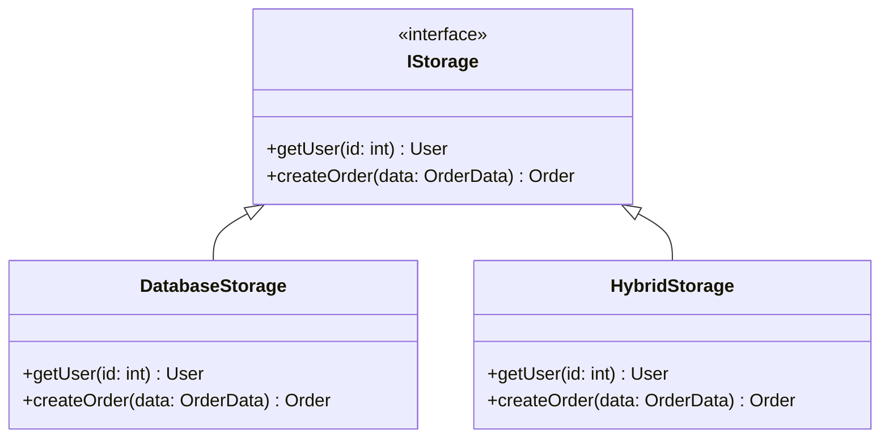
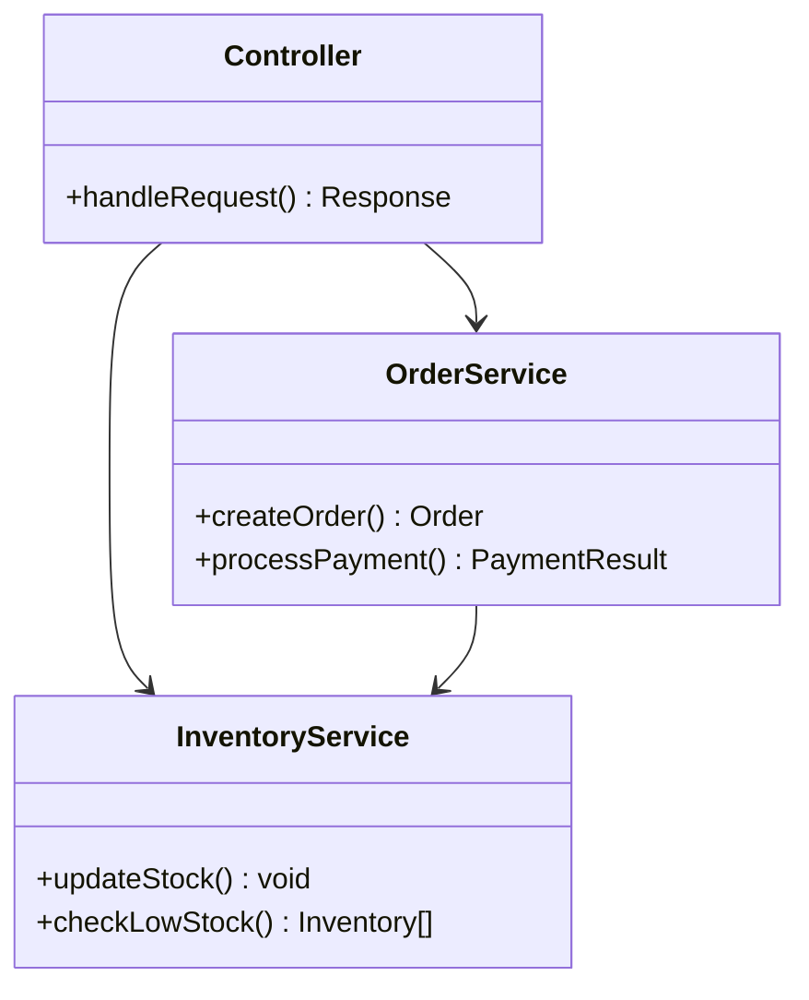

# Coffee Shop POS System - Class Diagram

## System Architecture and Object Structure

```mermaid
classDiagram
    %% Core Entity Classes
    class User {
        +int id
        +string username
        +string password
        +string role
        +DateTime createdAt
        +validateCredentials() boolean
        +hasPermission(action: string) boolean
        +updatePassword(newPassword: string) void
    }

    class Product {
        +int id
        +string name
        +decimal price
        +string category
        +string size
        +string imageUrl
        +DateTime createdAt
        +calculatePrice(size: string) decimal
        +getIngredients() ProductIngredient[]
        +isAvailable() boolean
        +updateStock(quantity: int) void
    }

    class Inventory {
        +int id
        +string name
        +decimal currentStock
        +decimal minimumStock
        +string unit
        +string containerType
        +int numberOfContainers
        +decimal quantityPerUnit
        +string secondaryUnit
        +DateTime createdAt
        +isLowStock() boolean
        +calculateTotalStock() decimal
        +deductStock(amount: decimal) void
        +restockItem(amount: decimal) void
        +convertUnits() string
    }

    class Order {
        +int id
        +string orderNumber
        +decimal total
        +decimal amountPaid
        +decimal change
        +int userId
        +DateTime createdAt
        +generateOrderNumber() string
        +calculateTotal() decimal
        +processPayment(amount: decimal) boolean
        +addItem(product: Product, quantity: int) void
        +getReceipt() OrderReceipt
    }

    class OrderItem {
        +int id
        +int orderId
        +int productId
        +string productName
        +string size
        +decimal price
        +int quantity
        +calculateSubtotal() decimal
        +getProduct() Product
    }

    class ProductIngredient {
        +int id
        +int productId
        +int inventoryId
        +decimal quantityUsed
        +string size
        +validateQuantity() boolean
        +checkAvailability() boolean
    }

    class Category {
        +int id
        +string name
        +int displayOrder
        +DateTime createdAt
        +getProducts() Product[]
        +updateDisplayOrder(order: int) void
    }

    %% Service Classes
    class AuthService {
        -sessionStore: SessionStore
        +login(username: string, password: string) User
        +logout(sessionId: string) boolean
        +validateSession(sessionId: string) User
        +hashPassword(password: string) string
        +comparePasswords(supplied: string, stored: string) boolean
        +createSession(user: User) string
    }

    class InventoryService {
        -storage: IStorage
        +checkStockLevels() Inventory[]
        +getLowStockItems() Inventory[]
        +updateInventoryForOrder(orderId: int) void
        +restockItem(itemId: int, amount: decimal) void
        +calculateContainerQuantity(item: Inventory) decimal
        +sendLowStockAlert(item: Inventory) void
    }

    class OrderService {
        -storage: IStorage
        -inventoryService: InventoryService
        +createOrder(orderData: OrderData) Order
        +processPayment(orderId: int, amount: decimal) PaymentResult
        +calculateChange(total: decimal, paid: decimal) decimal
        +generateReceipt(orderId: int) OrderReceipt
        +validateOrderItems(items: OrderItem[]) boolean
    }

    class ProductService {
        -storage: IStorage
        +getProductsByCategory(category: string) Product[]
        +getProductIngredients(productId: int) ProductIngredient[]
        +createProduct(productData: ProductData) Product
        +updateProductIngredients(productId: int, ingredients: ProductIngredient[]) void
        +checkProductAvailability(productId: int) boolean
    }

    class SalesAnalyticsService {
        -storage: IStorage
        +getSalesData(fromDate: Date, toDate: Date) SalesData[]
        +generateDailyReport(date: Date) SalesReport
        +generateMonthlyReport(month: int, year: int) SalesReport
        +getNonSellingProducts(fromDate: Date, toDate: Date) Product[]
        +calculateTotalRevenue(period: DateRange) decimal
        +getTopSellingProducts(limit: int) Product[]
    }

    %% Data Transfer Objects
    class OrderData {
        +decimal total
        +decimal amountPaid
        +int userId
        +OrderItem[] items
        +validate() boolean
    }

    class SalesData {
        +int id
        +int productId
        +string productName
        +string size
        +decimal price
        +int volume
        +decimal totalSales
        +string categoryName
    }

    class PaymentResult {
        +boolean success
        +decimal change
        +string message
        +DateTime timestamp
    }

    class OrderReceipt {
        +string orderNumber
        +DateTime timestamp
        +OrderItem[] items
        +decimal subtotal
        +decimal total
        +decimal amountPaid
        +decimal change
        +string cashierName
    }

    %% Storage Interface
    class IStorage {
        <<interface>>
        +getUser(id: int) User
        +getUserByUsername(username: string) User
        +createUser(userData: InsertUser) User
        +getAllInventoryItems() Inventory[]
        +getLowStockItems() Inventory[]
        +getProductsByCategory(category: string) Product[]
        +createOrder(orderData: OrderData, items: OrderItem[], userId: int) Order
        +getSalesData(fromDate: Date, toDate: Date) SalesData[]
    }

    class DatabaseStorage {
        -db: DrizzleDB
        -sessionStore: SessionStore
        +getUser(id: int) User
        +getUserByUsername(username: string) User
        +createUser(userData: InsertUser) User
        +getAllInventoryItems() Inventory[]
        +updateInventoryForOrder(productId: int, quantity: int) void
        +createOrder(orderData: OrderData, items: OrderItem[], userId: int) Order
        -executeQuery(query: string) QueryResult
        -handleTransaction(operation: Function) void
    }

    %% UI Component Classes
    class AuthPage {
        -useAuth: AuthHook
        +handleLogin(credentials: LoginData) void
        +handleRegister(userData: RegisterData) void
        +validateForm() boolean
        +redirectIfAuthenticated() void
    }

    class DashboardPage {
        -useAuth: AuthHook
        -useQuery: QueryHook
        +loadDashboardData() void
        +handleQuickActions() void
        +displaySalesOverview() void
    }

    class ProductCard {
        +product: Product
        +addToCart(product: Product, size: string) void
        +displayProductInfo() void
        +handleSizeSelection() void
    }

    class InventoryForm {
        +inventoryItem: Inventory
        +isOpen: boolean
        +handleSubmit(data: FormData) void
        +validateInput() boolean
        +calculateTotalStock() decimal
    }

    class OrderPanel {
        +cartItems: CartItem[]
        +calculateTotal() decimal
        +processCheckout() void
        +displayPaymentForm() void
        +generateReceipt() void
    }

    %% Relationships
    User ||--o{ Order : creates
    Order ||--o{ OrderItem : contains
    Product ||--o{ OrderItem : featured_in
    Product ||--o{ ProductIngredient : requires
    Inventory ||--o{ ProductIngredient : supplies
    Category ||--o{ Product : categorizes

    %% Service Dependencies
    AuthService ..> User : manages
    InventoryService ..> Inventory : manages
    OrderService ..> Order : manages
    ProductService ..> Product : manages
    SalesAnalyticsService ..> SalesData : generates

    %% Storage Implementation
    IStorage <|-- DatabaseStorage : implements
    
    %% Service Dependencies on Storage
    AuthService --> IStorage : uses
    InventoryService --> IStorage : uses
    OrderService --> IStorage : uses
    ProductService --> IStorage : uses
    SalesAnalyticsService --> IStorage : uses

    %% UI Component Dependencies
    AuthPage ..> AuthService : uses
    DashboardPage ..> ProductService : uses
    ProductCard ..> OrderService : uses
    InventoryForm ..> InventoryService : uses
    OrderPanel ..> OrderService : uses

    %% Cross-Service Dependencies
    OrderService --> InventoryService : updates_stock
    OrderService --> ProductService : validates_products
```

## Class Hierarchy and Patterns

### **🏗️ Architecture Patterns**

#### **Repository Pattern**


#### **Service Layer Pattern**


### **🎯 Key Design Principles**

#### **Single Responsibility**
- Each class has one primary responsibility
- Services handle specific business logic
- DTOs carry data without behavior

#### **Dependency Injection**
- Services depend on interfaces, not concrete classes
- Storage implementation can be swapped
- Testable and maintainable code

#### **Domain-Driven Design**
- Business entities reflect real-world concepts
- Rich domain models with behavior
- Clear separation of concerns

## Method Details

### **🔐 Authentication Methods**
```typescript
// AuthService key methods
login(username: string, password: string): User | null
validateSession(sessionId: string): User | null
hashPassword(password: string): string
```

### **📦 Inventory Operations**
```typescript
// InventoryService key methods
checkStockLevels(): Inventory[]
restockItem(itemId: int, amount: decimal): void
updateInventoryForOrder(orderId: int): void
```

### **🛒 Order Processing**
```typescript
// OrderService key methods
createOrder(orderData: OrderData): Order
processPayment(orderId: int, amount: decimal): PaymentResult
generateReceipt(orderId: int): OrderReceipt
```

This class diagram shows the complete object-oriented structure of your coffee shop system, demonstrating how all components work together to create a robust POS platform!