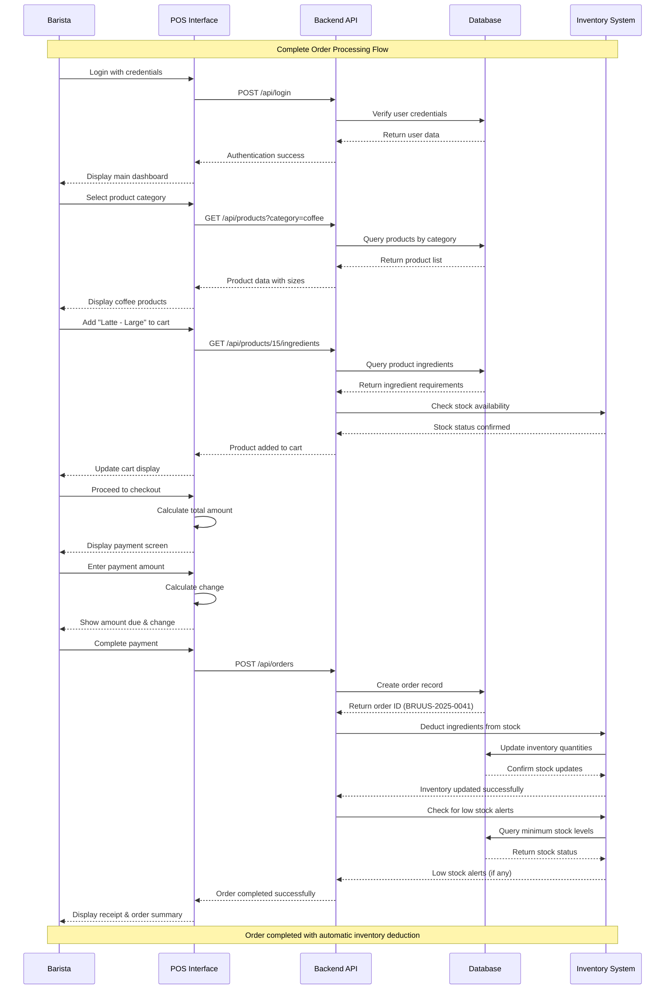
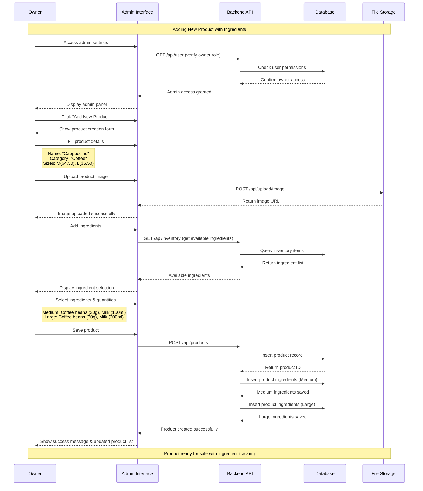
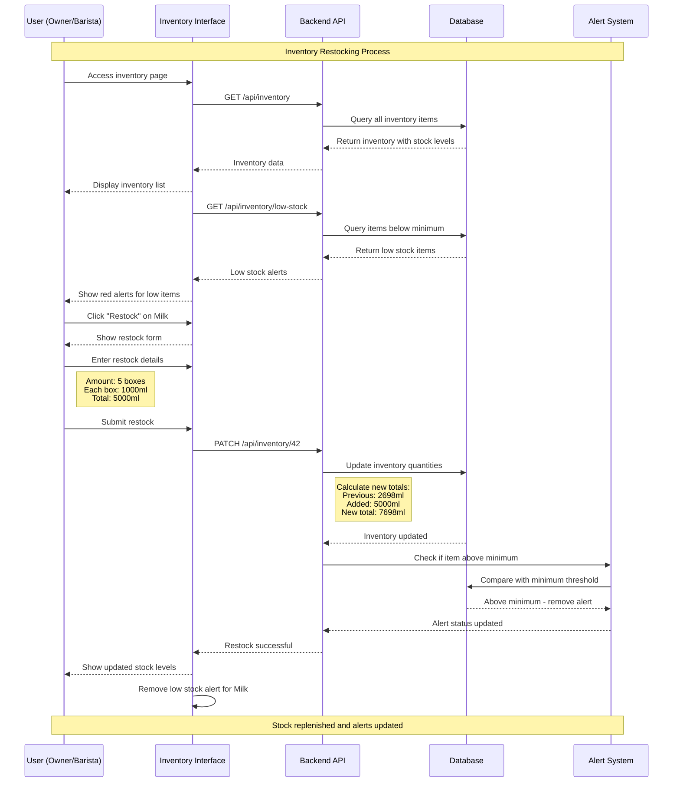
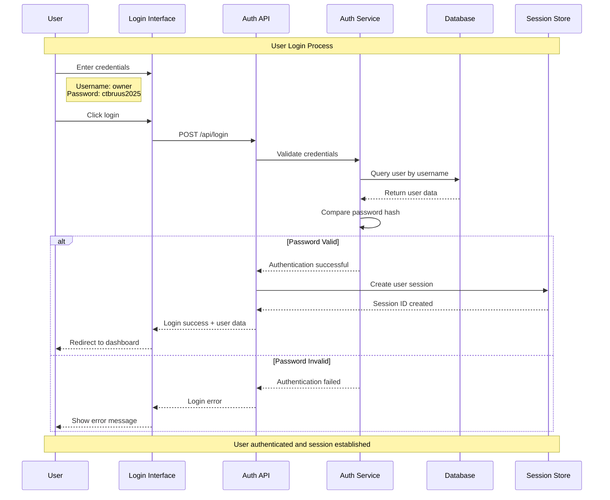
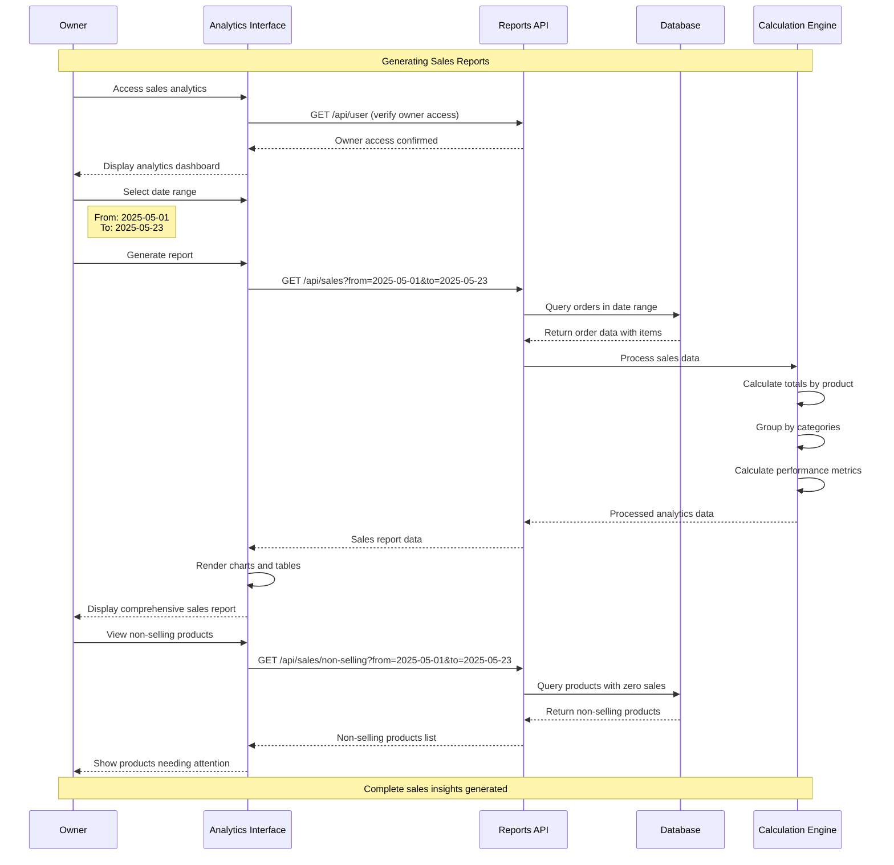

# Coffee Shop POS System - Sequence Diagrams

## System Interactions Over Time

### 1. Order Processing Sequence

### 2. Product Management Sequence

### 3. Inventory Management Sequence

### 4. User Authentication Sequence

### 5. Sales Analytics Sequence

## Key Sequence Characteristics

### **⏱️ Timing & Flow**
- **Synchronous Operations**: User interactions, API calls
- **Asynchronous Operations**: File uploads, alert checks
- **Parallel Processing**: Stock checks during order processing

### **🔄 Error Handling Patterns**
- **Authentication failures**: Graceful error messages
- **Stock unavailable**: Prevent order completion
- **Database errors**: Rollback transactions

### **🎯 Performance Optimizations**
- **Caching**: Frequent inventory queries
- **Batching**: Multiple ingredient updates
- **Lazy Loading**: Product images and details

These sequence diagrams show exactly how your coffee shop system processes requests step-by-step, ensuring smooth operations and proper data flow!