# Coffee Shop POS System - Use Case Diagram

## User Interactions and System Functionalities

```mermaid
graph TB
    %% Actors
    Owner[👤 Owner]
    Barista[👤 Barista]
    Customer[👤 Customer]
    System[🖥️ POS System]

    %% Owner Use Cases
    Owner --> UC1[Manage User Accounts]
    Owner --> UC2[Create Products]
    Owner --> UC3[Edit Products]
    Owner --> UC4[Delete Products]
    Owner --> UC5[Manage Inventory]
    Owner --> UC6[Restock Items]
    Owner --> UC7[Delete Inventory Items]
    Owner --> UC8[View Sales Analytics]
    Owner --> UC9[Process Orders]
    Owner --> UC10[Generate Reports]
    Owner --> UC11[Configure System Settings]

    %% Barista Use Cases
    Barista --> UC9[Process Orders]
    Barista --> UC12[View Inventory Status]
    Barista --> UC13[Add Products to Cart]
    Barista --> UC14[Calculate Payment]
    Barista --> UC15[Generate Receipt]
    Barista --> UC16[View Low Stock Alerts]

    %% System Use Cases (Internal)
    System --> UC17[Monitor Stock Levels]
    System --> UC18[Send Low Stock Alerts]
    System --> UC19[Update Inventory Automatically]
    System --> UC20[Calculate Change]
    System --> UC21[Generate Order Numbers]
    System --> UC22[Track Sales Data]

    %% Customer Interactions (Indirect through staff)
    Customer -.-> UC23[Place Order]
    Customer -.-> UC24[Make Payment]
    Customer -.-> UC25[Receive Receipt]

    %% Use Case Details
    UC1 --> UC1A[Create New User]
    UC1 --> UC1B[Edit User Role]
    UC1 --> UC1C[Update Password]
    UC1 --> UC1D[Delete User]

    UC2 --> UC2A[Set Product Name]
    UC2 --> UC2B[Set Price for Sizes]
    UC2 --> UC2C[Assign Category]
    UC2 --> UC2D[Link Ingredients]
    UC2 --> UC2E[Upload Image]

    UC5 --> UC5A[Add New Ingredient]
    UC5 --> UC5B[Set Minimum Stock]
    UC5 --> UC5C[Configure Units]
    UC5 --> UC5D[Set Container Types]

    UC8 --> UC8A[Daily Sales Report]
    UC8 --> UC8B[Monthly Sales Report]
    UC8 --> UC8C[Product Performance]
    UC8 --> UC8D[Non-Selling Products]

    UC9 --> UC9A[Select Products]
    UC9 --> UC9B[Choose Size Options]
    UC9 --> UC9C[Add to Cart]
    UC9 --> UC9D[Process Payment]
    UC9E[Complete Order]

    %% System Relationships
    UC17 -.-> UC18
    UC9 -.-> UC19
    UC9 -.-> UC21
    UC9 -.-> UC22

    %% Styling
    classDef actor fill:#e1f5fe,stroke:#01579b,stroke-width:2px
    classDef usecase fill:#f3e5f5,stroke:#4a148c,stroke-width:2px
    classDef system fill:#e8f5e8,stroke:#1b5e20,stroke-width:2px
    classDef subcase fill:#fff3e0,stroke:#e65100,stroke-width:1px

    class Owner,Barista,Customer actor
    class UC1,UC2,UC3,UC4,UC5,UC6,UC7,UC8,UC9,UC10,UC11,UC12,UC13,UC14,UC15,UC16,UC23,UC24,UC25 usecase
    class System,UC17,UC18,UC19,UC20,UC21,UC22 system
    class UC1A,UC1B,UC1C,UC1D,UC2A,UC2B,UC2C,UC2D,UC2E,UC5A,UC5B,UC5C,UC5D,UC8A,UC8B,UC8C,UC8D,UC9A,UC9B,UC9C,UC9D,UC9E subcase
```

## Actor Descriptions

### 👤 **Owner (Admin)**
- **Primary Role**: Complete system management and oversight
- **Access Level**: Full administrative privileges
- **Key Responsibilities**: 
  - User account management
  - Product catalog management
  - Inventory control
  - Sales analytics and reporting
  - System configuration

### 👤 **Barista (Staff)**
- **Primary Role**: Daily operations and customer service
- **Access Level**: Operational privileges (limited admin)
- **Key Responsibilities**:
  - Order processing
  - Payment handling
  - Basic inventory monitoring
  - Customer interaction

### 👤 **Customer**
- **Primary Role**: End user receiving service
- **Access Level**: None (indirect interaction through staff)
- **Key Interactions**:
  - Places orders through staff
  - Makes payments
  - Receives receipts and products

### 🖥️ **POS System**
- **Primary Role**: Automated system processes
- **Key Functions**:
  - Real-time inventory tracking
  - Automatic calculations
  - Alert generation
  - Data management

## Use Case Priorities

### **High Priority (Core Functions)**
- Process Orders (UC9)
- Manage Inventory (UC5)
- Monitor Stock Levels (UC17)
- Generate Reports (UC8)

### **Medium Priority (Management Functions)**
- Manage User Accounts (UC1)
- Create/Edit Products (UC2, UC3)
- System Configuration (UC11)

### **Low Priority (Enhancement Functions)**
- Advanced Analytics (UC8D)
- Automated Alerts (UC18)
- Receipt Customization (UC15)

This use case diagram shows all the ways users interact with your coffee shop POS system and helps identify the core functionality needed for successful operations.